# Pedalboard Pro
Pedalboard Pro is a fictional company that offers a custom design and build service. The website aims to showcase the services they offer and also act as a first point of contact between the company and the client. 

This project has been created as part of my level 5 diploma web application course.

## [VISIT MY LIVE PROJECT HERE!](https://nickgav82.github.io/PEDALBOARD-PRO/)

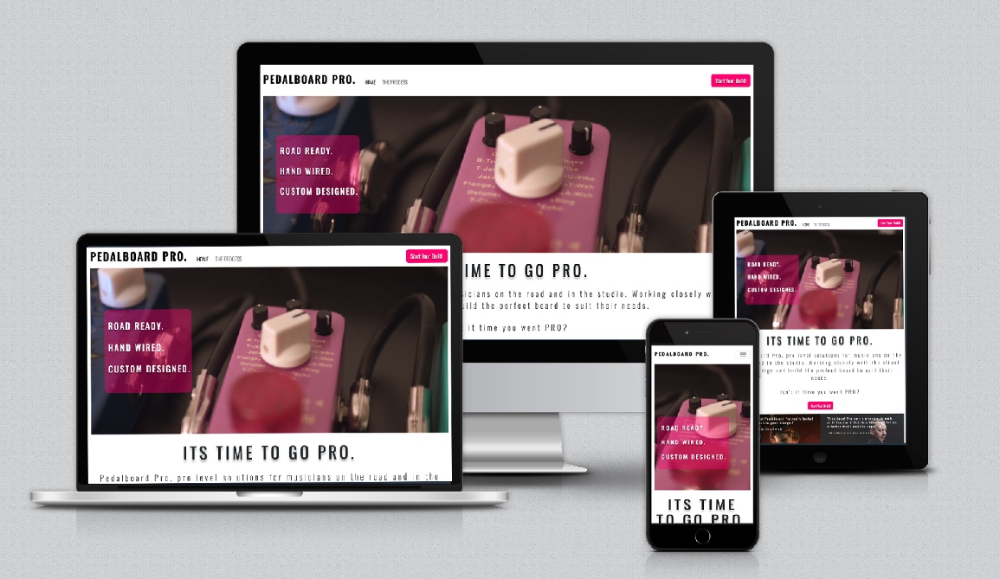

## User Experience 

### Company Goals -
1. To clearly showcase their services and past client testimonals in a simple and easily navigated experience.
2. To make it simple and intuitve for the customer to make contact. 

### User Goals -
1. To find a visually enjoyable website that is easily understood aand navigated. 
2. To fully and quickly understand the services that the company offer.
3. To be able to easily conact the company.

## Wireframes

### Page 1 mock up

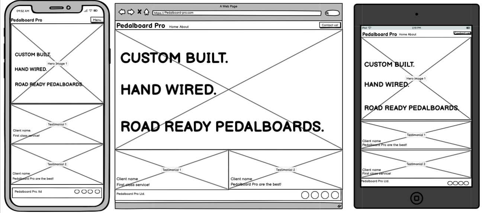

### Page 2 mock up

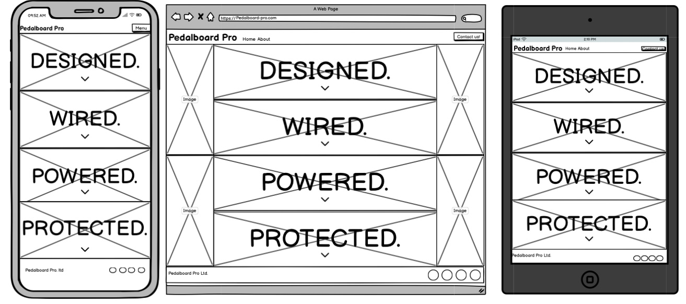

### Page 3 mock up

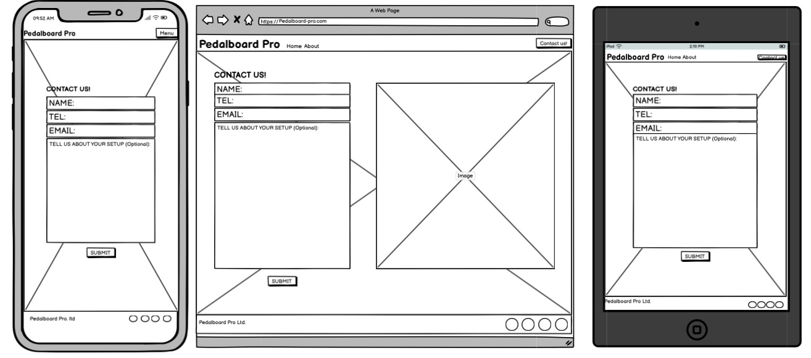

## Design

### Typography -
- The 'Oswald' font was used throughout the project with a fall back font of sans-serif.

### Colour Scheme -
- A very simple pallete of Black, White and Bright Pink have been used within the project. Opacity was used with the Bright Pink when needed to either brighten or dull down the colour.

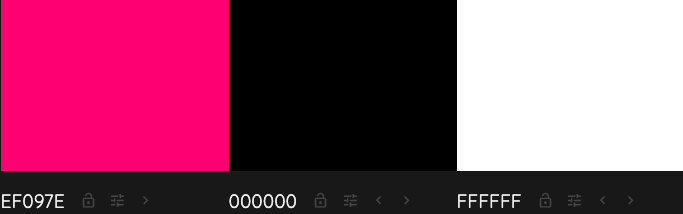 

## Features

The website attempts a cohesive appearance by using the same header and footer across all pages and by maintaining the simple colour scheme. 

### Header - 
The header sets the tone of the simplistic/stylistic design of the site containing the brand name of the company followed by a link for 'Home' and 'The Process'. All of which are in the uniform 'Oswald' font. To the far right of the page is a button/link to the form page which has been styled in the Bright Pink in order to draw the users attention and entice them to navigate to that page and complete the form.
#### Full screen header -
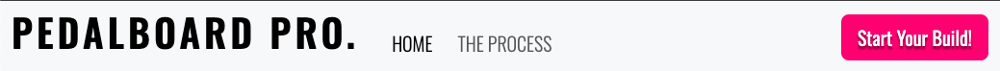
#### Small screen header with toggle menu -
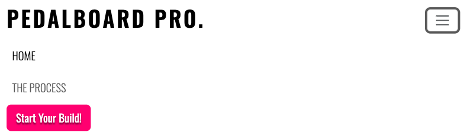

### Footer - 
The footer is kept simple with links to social media that when hovered over by the mouse they then turn the Bright Pink colour  that is being use throughout the site.

### Home Page -
The home page contains three main sections. The first section being a full screen width video panning across a guitar fx pedalboard with a responsive overlay text feature.
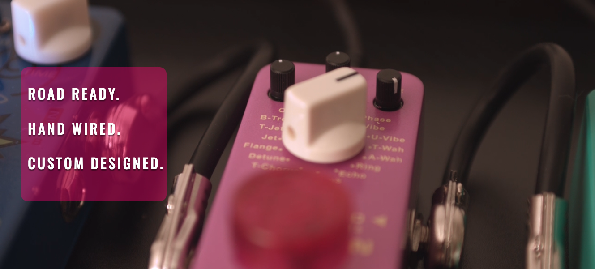

Next we have an "about"/mission statement section, briefly describing the company and also featuring another button to again try and lure the user to the form page.
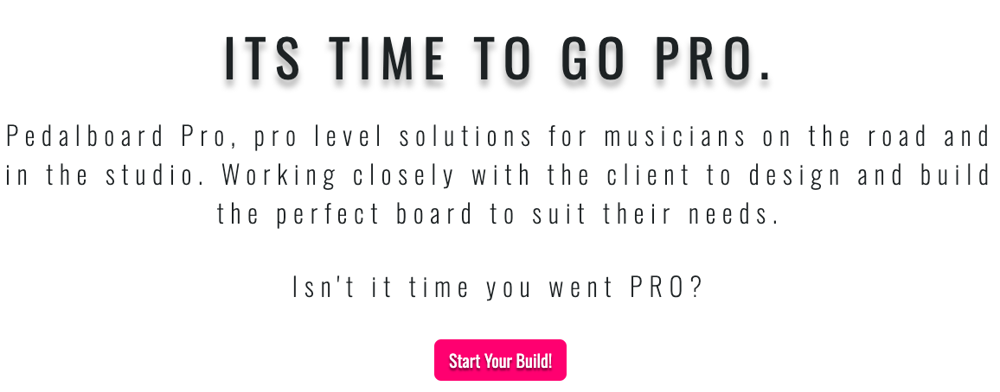

Lastly on the Home Page we have two customer testimonials featuring responsive images and text.

#### Testimonials on large screen -
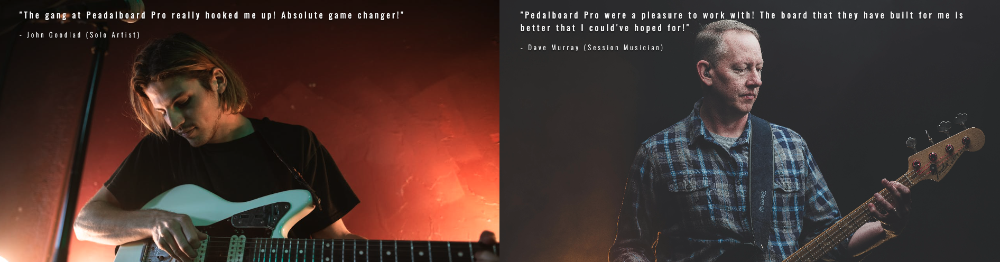
#### Testimonials on small screen - 
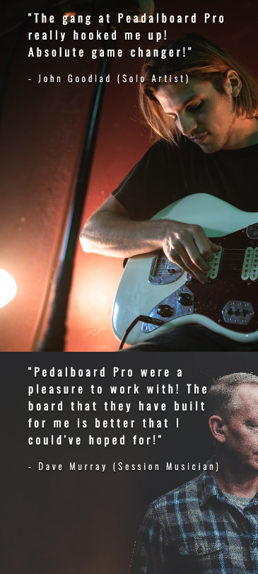

### About Page (The Process) - 
The about page shows the four stages of Pedalboard Pro's process featuring four cards with each depicting their particular parts of the process and with each card also containing the repeated "pink button" to direct users to the form page.
#### About page -
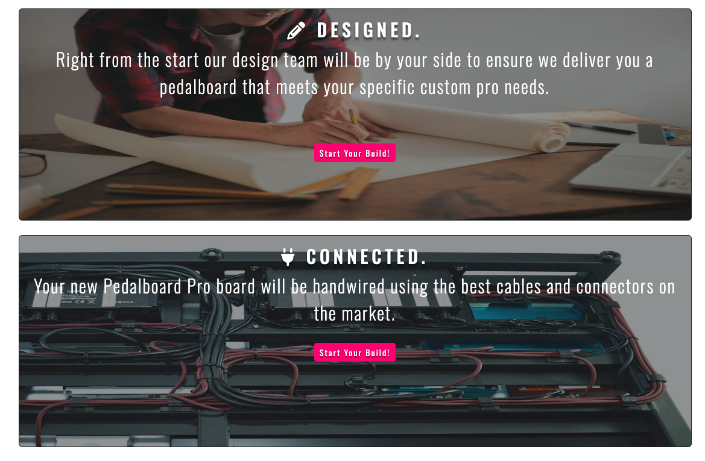
#### Form page -
The form page contains a simple background image with a "sign up" type form that utilizes both the running 'Oswald' font and Bright Pink colour scheme elements.
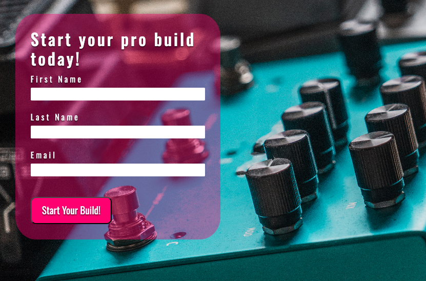

## Technologies 

### Languages -
- [HTML5](https://en.wikipedia.org/wiki/HTML5) 
- [CSS3](https://en.wikipedia.org/wiki/CSS)

### Libraries and Framewoks -
- [Balsamiq Wireframes](https://balsamiq.com) was used in the making of the wireframe mockups during the design phase.
- [Bootstrap](https://getbootstrap.com/) used for for basic navbar, layout and responsiveness.
- [Font Awesome](https://fontawesome.com/v4) supplied all icons used througout the site such as those used for the social media links in the footer.
- [GitHub](https://github.com/) was used for storing my repository and the deployment of my live project.
- [Unblast](https://unblast.com/) used in tha making of the resonsive design mockup at the top of the page. 
- [Adobe Photoshop](https://adobe.com) was also used in the creation of the responsive mock up design.
- [Google Fonts](https://fonts.google.com/) supplied the 'Oswald' font which i used exclusively in this project.

## Testing and Validation

Both the [W3C Markup Validator](https://validator.w3.org/) and [W3C CSS Validator](https://jigsaw.w3.org/css-validator/) were used to test each page of the project to ensure the correct syntax was used. Main errors that occurred were the use of the same 'id' more than once. All errors have since been rectified and corrected. All pages have since passed the validation test. 

### Initial HTML tests/errors - 
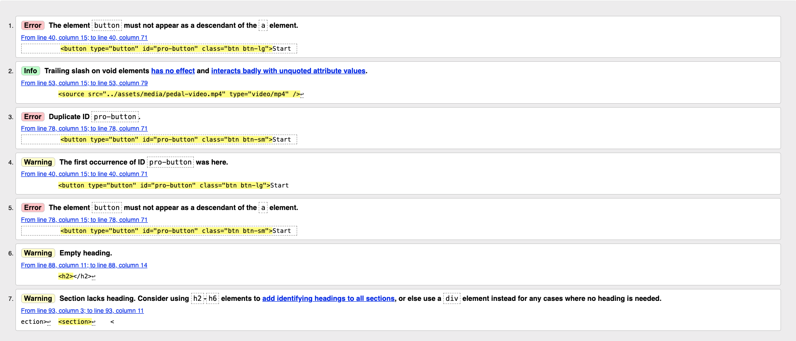 

### Passed HTML Validation -
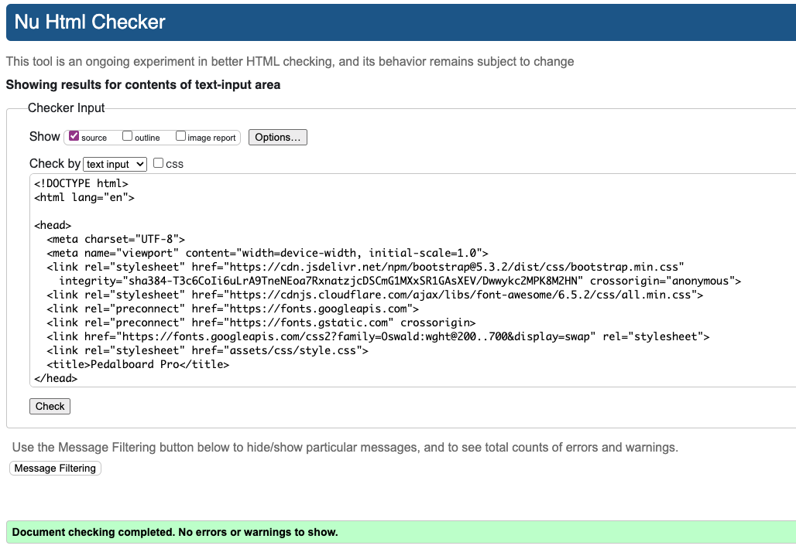

### Initial CSS test/errors -
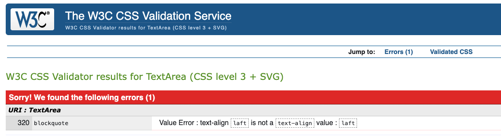

### Passed CSS Validation -
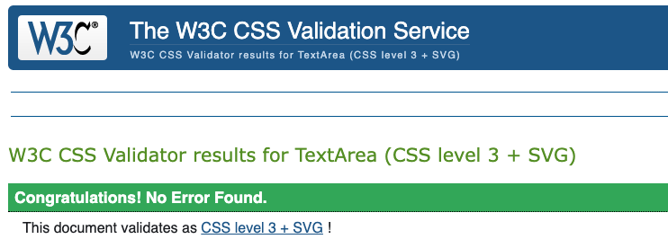

## Google Devtools/Lighthouse
While testing accessibilty and performance using Devtools/Lighthouse, the common issue was the file size of the images and video that were used. The images and video and have since been compressed to enhance performance. 

### Index test -
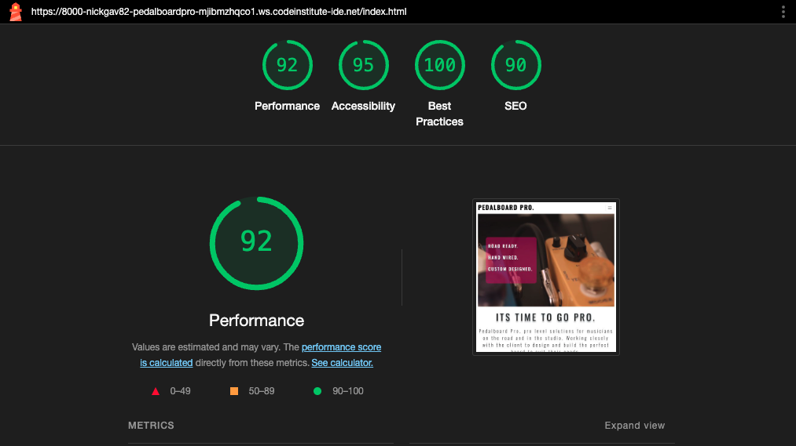
### About test -
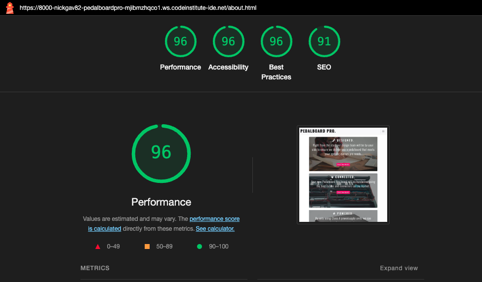
### Form test -
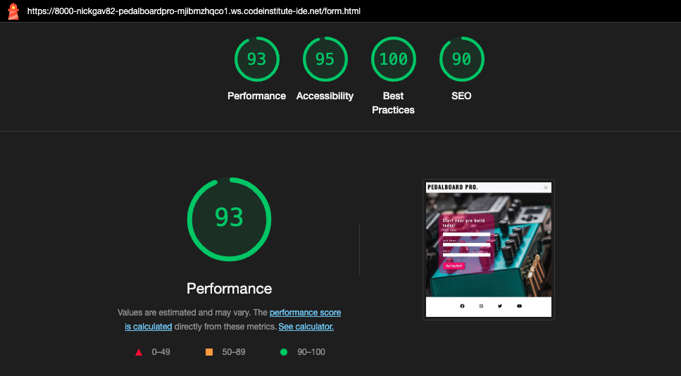

## Deployment
This project was deployed on to GitHub Pages. To do this I did the following.

1. Log in to the [GitHub Repository](https://github.com/NICKGAV82/PEDALBOARD-PRO)
2. Go to 'Settings'.
3. From 'Settings' navigate to 'GitHub Pages'.
4. Find 'Source' and click the 'None' dropdown menu and select 'Main Branch'.
5. Once the page has refreshed, then locate the [Live Link](https://github.com/NICKGAV82/PEDALBOARD-PRO/deployments) in the 'GitHub Pages' section.

## Reference/Code Resources 
- [Dev.to](https://dev.to/) Referenced for image opacity.
- [Stack Overflow](https://stackoverflow.com/questions/41172023/how-to-overlay-text-on-top-of-a-responsive-image-responsively) Code was used and then editid to suit my needs in overlay text on home page video background.
- [Code Institute](https://codeinstitute.net) The 'Love Running' course lessons were very helpful with the completion of this project.
- [W3 Schools](https://www.w3schools.com/) was an invaluable resource during this project.

## Media Credits 
- Background video by Yucel Yimaz licensed through [Adobe Stock](http://stock.adobe.com).
- Pedal-cabling image was downloaded from [Google Images](https://images.google.co.uk/)
- 'Male guitrist' Image by RDNE Stock Project via [Pexels](https://www.pexels.com/).
- 'Case' image was sourced through [Google Images](https://images.google.co.uk/)
- 'Bass Player' Image by Ryan Holloway via [Pexels](https://www.pexels.com/).
- Form background image by Tom S via licensed through [Adobe Stock](http;//stock.adobe.com).
- Powersupply image via [Adobe Stock](http://stock.adobe.com).

## Acknowledgements
Special thanks to both my tutor Miguel Ortega Legorreta at City of Bristol College for his support and guidance and to my mentor Rory Sheridan for his advice and feedback. I also have to mention the Slack community for their help in retreiveing my code from more thasn one hole! Finally thankyou to Code Institue for creating a course that can enable a complete coding beginner to create this project all the while enjoying the process!  

[def]: ../assets/images/mock-up.jpg