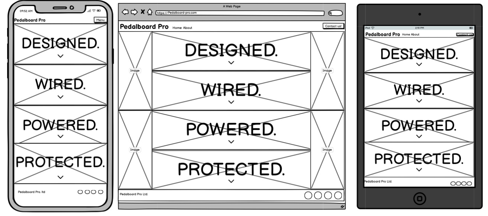

# Pedalboard Pro
Pedalboard Pro is a fictional company that offers a custom design and build service. The website aims to showcase the services they offer and also act as a first point of conact between the company and the client. 

This project has been created as part of my level 5 diploma web application course.

## User Experience 

### Company Goals -
1. To clearly showcase their services and past client testimonals in a simple and easily navigated experience.
2. To make it simple and intuitve for the customer to make contact. 

### User Goals -
1. To find a visually enjoyable website that is easily understood aand navigated. 
2. To fully and quickly undersatnd the services that the company offer.
3. To be able to easily conact the company.

## Wireframes

### Page 1 mock up

### Page 2 mock up

### Page 3 mock up

